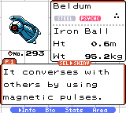
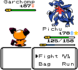
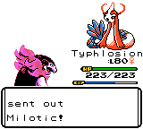
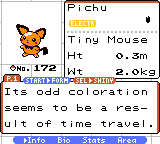
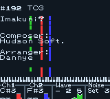
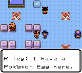
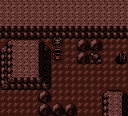
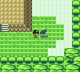

# The Nitpicker's Fork

This is a custom fork of [Pokémon Polished Crystal](https://github.com/Rangi42/polishedcrystal).

This fork's goal is to "fix" small details that nobody else would care about, but make the game "literally unplayable" to me. Details such as: Steven without his Metagross, Cynthia without her Garchomp, Umbreon not being able to learn Knock Off, etc..

## The current version of this fork is based on the 3.2.1 release.

## Changes:

- **Converted Fire/Thunder/Ice Punch into "Fire/Volt/Ice Strike", allowing Pokémon that would have access to Fire/Thunder/Ice Fang to also perform them and changing the move animation according to the Pokémon using it.**
- **Implemented [Crystal Gleam](https://github.com/katedering/crystal-gleam)'s Orange Islands Overhaul and Gen1 Hyper Beam/Giga Impact recharge mechanics.**
- **Maintained non-faithful buffs to regular Farfetch'd, Corsola, Qwilfish and Mr.Mime.**
- **New Pokémon Added:**
  - Torkoal
  - Feebas
  - Milotic
  - Beldum
  - Metang
  - Metagross
  - Gible
  - Gabite
  - Garchomp
  - Riolu
  - Lucario
    - **Also implemented ways to acquire them and gave them to the appropriate trainers.**
- **New Pokémon Forms Added:**
  - Pikachu-Colored Pichu
  - Upgraded Spiky-Eared Pichu into a non-cosmetic form with its own stats
  - Trainer-only forms for Gengar, Raichu and Xatu
- **Added some new music.**
- **Rematchable trainers such as Phone Trainers and Gym Leaders at the Saffron Dojo now scale with your badges.**
- **Umbreon can now learn Knock Off and Leafeon can now learn Cut (very important changes).**
- **Changed some Pokémon sprites, either due to personal preference or due to lack of rom space in the MBC3 version.**
- **...And some other details that are so minor even I forgot about them.**

## Credits

- [Everyone who worked on Polished Crystal and its other forks](https://github.com/Rangi42/polishedcrystal/graphs/contributors): Literally everything lmao. All I did was edit some .asm files with Notepad.
- [Johnnyz](https://johnnyz.smspower.org/): I got a good portion of the new music tracks from him.

## Screenshots

